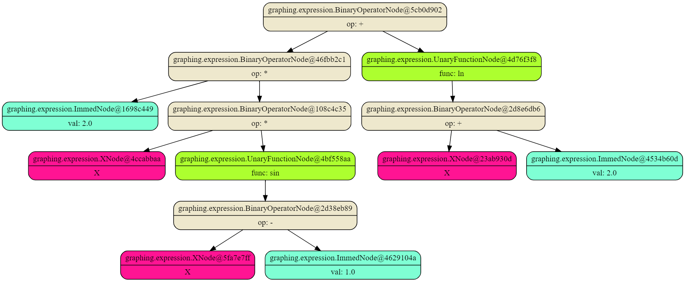

# GraphingCalculator
A simple graphing calculator.
## Requirements
This program requires Java 20, Python 3.10 and Matplotlib 3.8.1 to run.
## Supported operations
This program supports the following operations:
* Sum (+)
* Difference (-)
* Multiplication (*)
* Division (/)
* Power (^)
## Supported functions
This program supports the following functions:
* Sine (sin)
* Cosine (cos)
* Tangent (tan)
* Natural logarithm (ln)
* Exponent (exp)
* Square root (sqrt)
## Running the program
To run the program, compile it using pom from the repository. Resulting .jar file can be executed with the following command:
```
java -jar GraphingCalculator-1.0-SNAPSHOT.jar
```
The program generates a python script that can be run by the following command:
```
python plot.py
```

## Tree example
This program parses a mathematical expression into a syntax tree. Below is an example of a syntax tree for expression 2*x*sin(x - 1) + ln(x + 2) generated with [graphviz](https://dreampuf.github.io/GraphvizOnline).

## Plot example
The picture below shows a plot for expression 2*x*sin(x - 1) + ln(x + 2).

